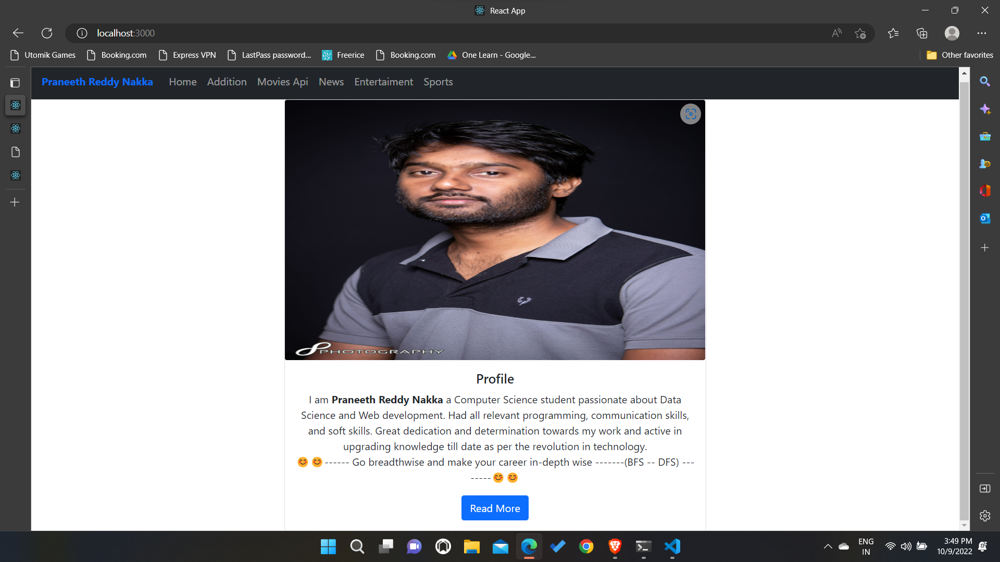
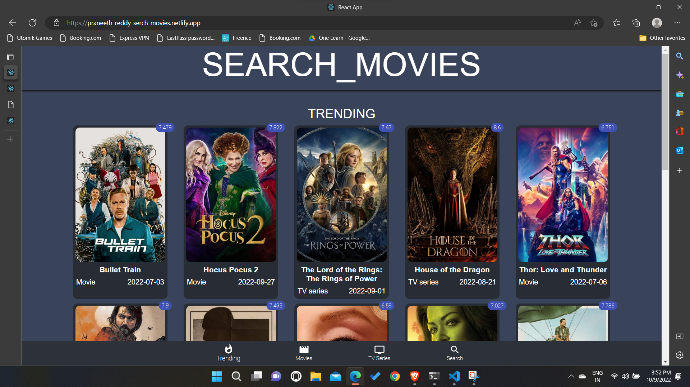
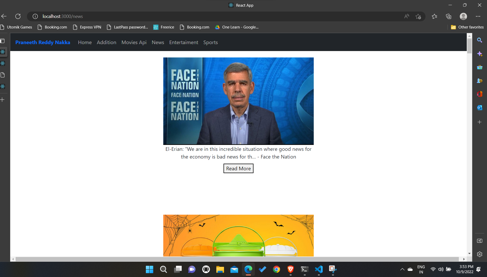
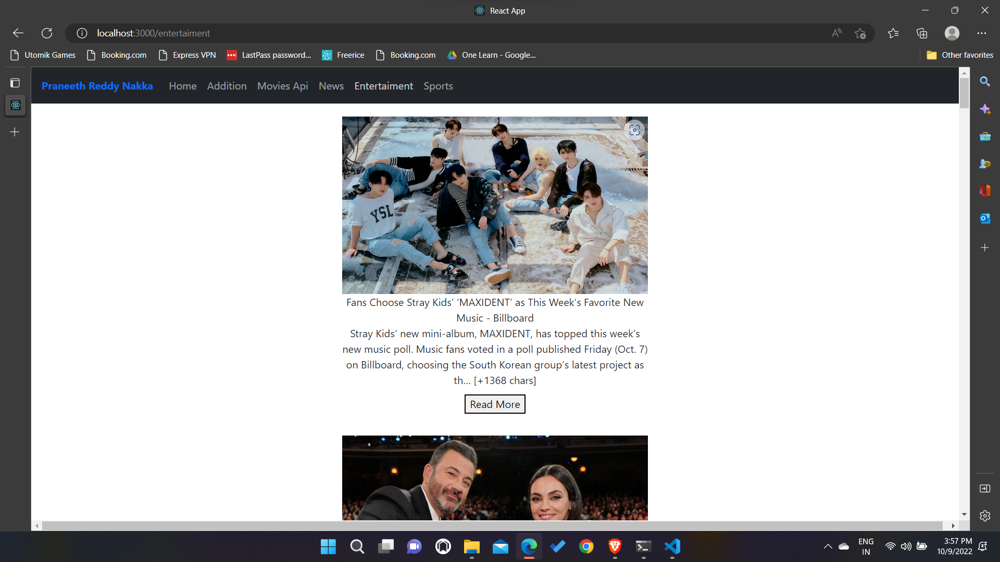

# Addition and API integration.

- The project mainly focusses on learning react and express js by doing
    some projects.The project lets you to understand the integration of
    both frontend and backend and helps in understanding the core concepts of 
    reactjs such as folder structure and single page application, reusable 
    components and easy routing.

- I used two api's in these project one is tmbd movies api https://www.themoviedb.org/settings/api
    
-   The other api that I used is https://newsapi.org/.


## Features

- Addition using communication between frontend and backend.
- Fetching movies through Movies API.
- Fetching latest news from News API.
- Responsive Layout and design.
- React for frontend.
- express for backend.


## Images
- Home Page
  
    
  

- Movies Page 
  
  

- News Page
  
    

- Entertaiment Page
  
    


## Run Locally

Clone the project

```bash
  git clone https://github.com/PRANEETH-REDDY-23899/Addition-and-Api-Inegration
```

Go to the project directory

```bash
  cd my-project
```

Install dependencies

```bash
  npm install
```

Start the server

```bash
  npm start
```


## Tech Stack

**Client:** React, Bootstap

**Server:** Node, Express


